# Supermarket sales

The growth of supermarkets in most populated cities are increasing and market competitions are also high. The dataset is one of the historical sales of supermarket company which has recorded in 3 different branches for 3 months data. Predictive data analytics methods are easy to apply with this dataset.

# Contents

1. **Import Libraries**

2. **Import Dataset**

3. **Understanding The Dataset**

4. **Data Cleansing**

   - cleaning date column

   - cleaning time column

5. **Data Analysis and Visualization**

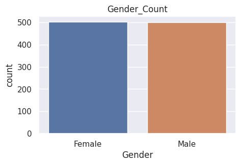

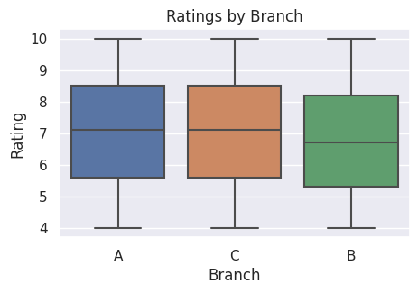

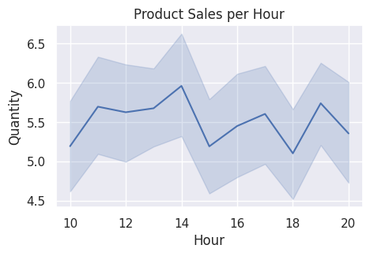

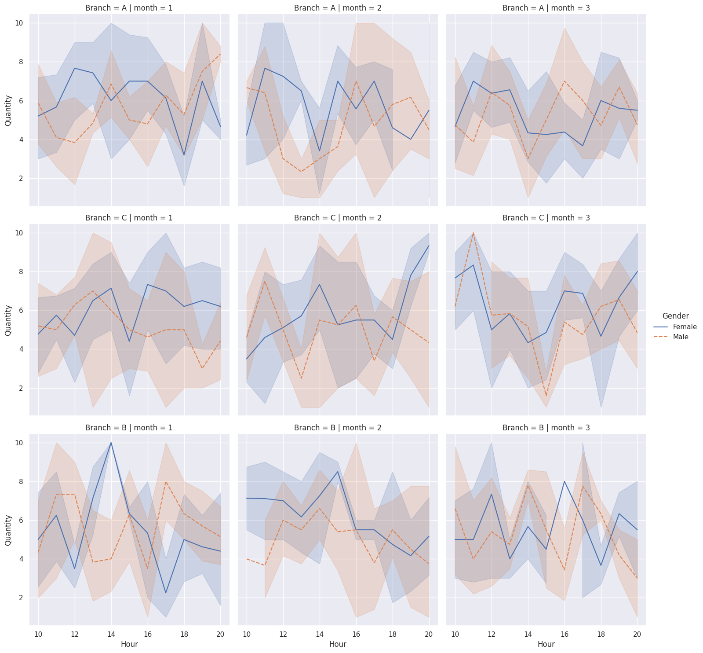

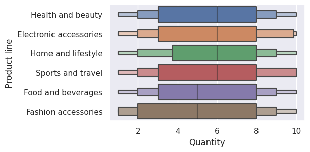

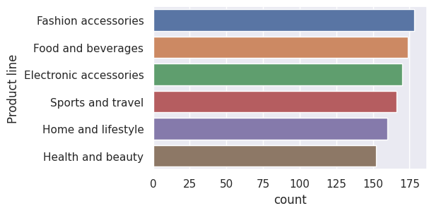

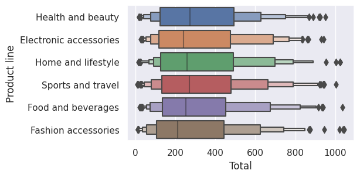

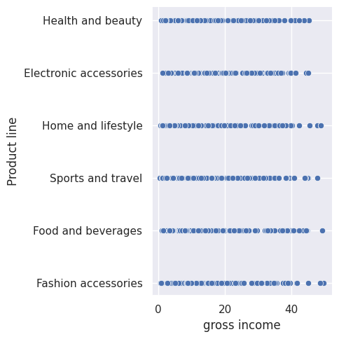

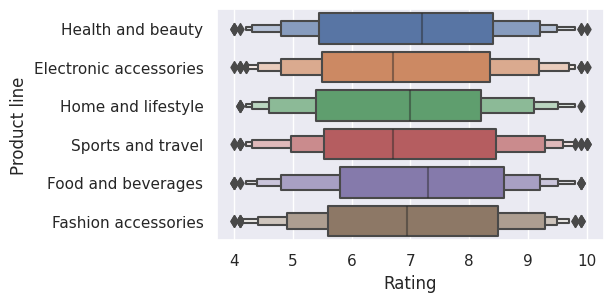

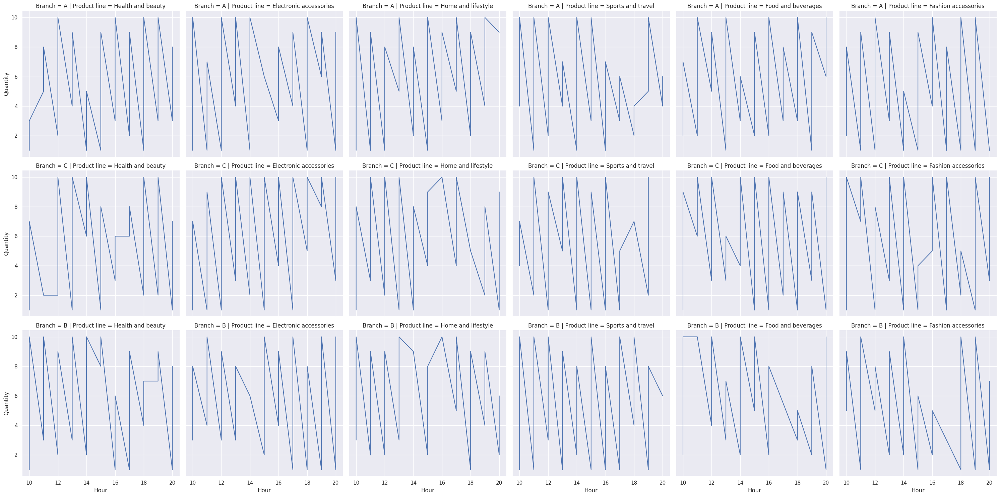

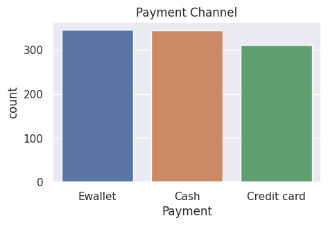

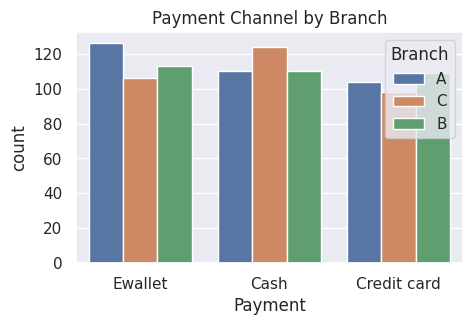

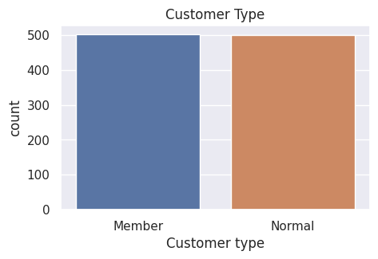

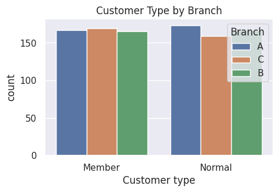

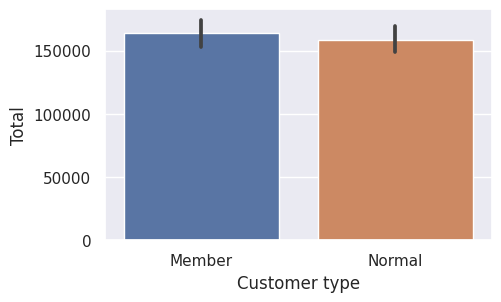

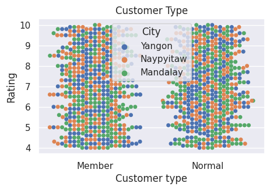

# About the data

### FEATURES:

- Invoice id: Computer generated sales slip invoice identification number.

- Branch: Branch of supercenter (3 branches are available identified by A, B and C).

- City: Location of supercenters.

- Customer type: Type of customers, recorded by Members for customers using member card and Normal for without member card.

- Gender: Gender type of customer.

- Product line: General item categorization groups - Electronic accessories, Fashion accessories, Food and beverages, Health and beauty, Home and lifestyle, Sports and travel.

- Unit price: Price of each product in $.

- Quantity: Number of products purchased by customer.

- Tax: 5% tax fee for customer buying.

- Total: Total price including tax.

- Date: Date of purchase (Record available from January 2019 to March 2019).

- Time: Purchase time (10am to 9pm).

- Payment: Payment used by customer for purchase (3 methods are available – Cash, Credit card and Ewallet).

- COGS: Cost of goods sold.

- Gross margin percentage: Gross margin percentage.

- Gross income: Gross income.

- Rating: Customer stratification rating on their overall shopping experience (On a scale of 1 to 10).
